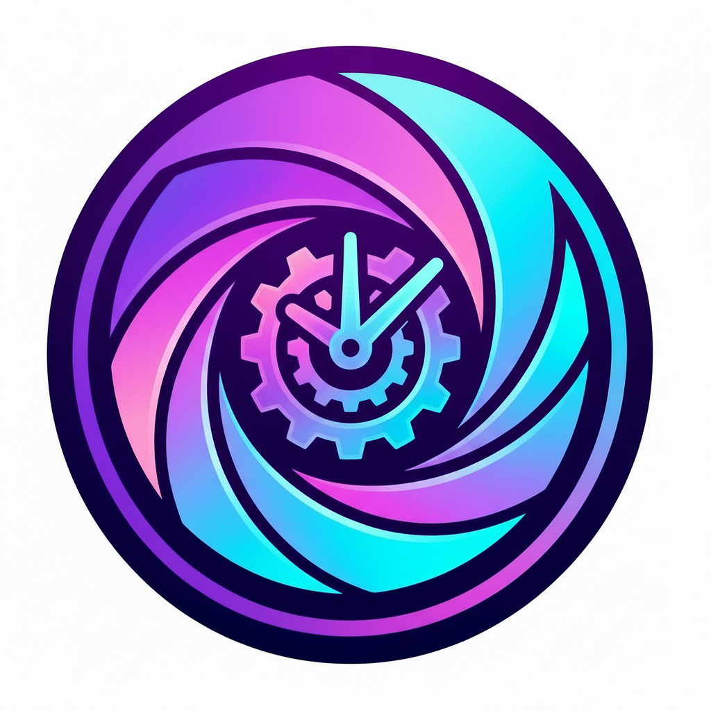

# TimeLens

A mobile app that transforms your photos into different historical eras using AI. Take a selfie and see yourself in the 1920s, 1950s, 1970s, 1980s, or Y2K era.

<p align="center">
  
</p>

## Features

- **Era Time Travel**: Transform photos into 6 distinct eras:
  - Silver Screen (1920s) - Black & white silent film aesthetic
  - Atomic (1950s) - Kodachrome colors and mid-century style
  - Groovy (1970s) - Warm tones and disco vibes
  - Neon Dreams (1980s) - Synthwave and neon aesthetics
  - Y2K (2000s) - Early digital camera look
  - Now (2020s) - Modern smartphone quality

- **AI-Powered Transformation**: Uses Google's Gemini 3 Pro to intelligently transform photos while preserving faces and key features

- **Easy Sharing**: Save transformed photos to your gallery or share directly to social media

## Tech Stack

- **Framework**: Flutter/Dart
- **Authentication**: Firebase Auth with Google Sign-In
- **AI**: Gemini 3 Pro Image Preview API
- **Distribution**: Firebase App Distribution

## Getting Started

### Prerequisites

- Flutter SDK 3.8.1+
- Android Studio or VS Code with Flutter extensions
- A Firebase project with Authentication enabled
- Gemini API key

### Setup

1. Clone the repository:
   ```bash
   git clone https://github.com/jawnty/timelens.git
   cd timelens
   ```

2. Install dependencies:
   ```bash
   flutter pub get
   ```

3. Configure Firebase:
   - Create a Firebase project
   - Enable Google Sign-In in Authentication
   - Download `google-services.json` and place it in `android/app/`

4. Configure Gemini API:
   - Get an API key from Google AI Studio
   - Pass it via `--dart-define` when building (see Building section)

5. Run the app:
   ```bash
   flutter run --dart-define=GEMINI_API_KEY=your_api_key_here
   ```

## Project Structure

```
lib/
├── main.dart              # App entry point
├── models/
│   └── era.dart           # Era definitions and prompts
├── screens/
│   ├── sign_in_screen.dart
│   ├── home_screen.dart
│   ├── processing_screen.dart
│   └── result_screen.dart
├── services/
│   ├── auth_service.dart  # Firebase authentication
│   └── gemini_service.dart # Gemini API integration
└── theme/
    └── app_theme.dart     # App styling
```

## Building

The Gemini API key must be passed at build time via `--dart-define`:

### Debug APK
```bash
flutter build apk --debug --dart-define=GEMINI_API_KEY=your_api_key_here
```

### Release APK
```bash
flutter build apk --release --dart-define=GEMINI_API_KEY=your_api_key_here
```

## License

Private project - All rights reserved.
